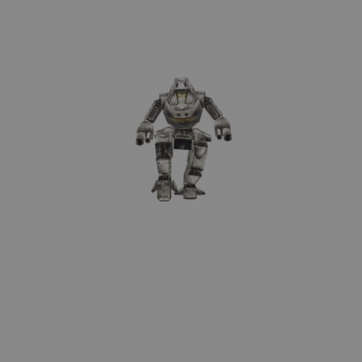

# MechWarrior 3 Asset Extractor

MechWarrior 3 Asset Extractor (`mech3ax`) is a library and some scripts to extract assets from the 1998 MechWarrior 3 game to modern formats. [There is a companion project](https://github.com/tobywf/mech3re) where I describe the reverse engineering of these assets, and how to extract other, semi-automatable assets such as ambient music and video files.

Obviously, this is an unofficial fan effort and not connected to the developers or publishers.

[](https://imgur.com/a/H5pB1Vd)

## Currently supported

- Various versions of the MechWarror 3 base game, including US versions 1.0, 1.1, 1.2, Gold Edition and German version 1.0 and 1.2 (patched). If you are in possession of any other versions, especially the French versions, please get in touch! (The expansion, Pirate's Moon, is [not yet supported](https://github.com/tobywf/mech3ax/issues/1).)
- Sound files (`soundsL.zbd`, `soundsH.zbd`) can be converted binary-accurately
- Interpreter files (`interp.zbd`) can be converted binary-accurately
- All texture and image files (`rimage.zbd`, `rmechtex*.zbd`, `rtexture*.zbd`, `texture*.zbd`) can be converted binary-accurately
- All messages extracted from `Mech3Msg.dll`
- Reader files (`reader*.zbd`) can be converted binary-accurately
- Animations (`motion.zbd`) can be converted binary-accurately. However, because the model data is not very well understood, applying the animations isn't perfect. [Some limbs have incorrect translations](https://github.com/tobywf/mech3ax/issues/2)
- 'mech models from `mechlib.zbd`, as well as the material index can be converted binary-accurately
- Animation definitions (`anim.zbd`) can be read and seem to match the reader files
- `gamez.zbd` files, which contain texture references, materials, meshes, and nodes for each scenario, can be converted binary-accurately (although there are some gaps in what certain values do)

Not supported (yet?):

- `anim.zbd` file writing
- The Pirate's Moon expansions ([GitHub issue](https://github.com/tobywf/mech3ax/issues/1))
- The demo likely won't ever be supported, because it uses different versions/data structures

Additionally, there is a stand-alone script that can convert extracted models to a `.blend` file for the 3D creation suite [Blender](https://www.blender.org/). Please see [Blender script](#blender-script) further down.

## How to use

**You will need a copy of the game. Do not ask me for an (illegal) copy.**

Python 3.8 or higher is required.

Dependencies are managed via [poetry](https://python-poetry.org/). To install all dependencies, use:

```bash
poetry install
```

I've now added a CLI, which can convert some files. Please be careful, files are overwritten without prompting. Use a different path for input files, and back them up/copy them somewhere else before using this.

The output file can be a file, a directory (in which case the filename will be inferred from the input), or not specified, in which case the filename is inferred and the current directory is used.

```bash
poetry run mech3_from_zbd messages "original/Mech3Msg.dll" "messages.json"
# messages cannot be converted back to a DLL for now
poetry run mech3_from_zbd interp "original/zbd/interp.zbd" "interp.json"
poetry run mech3_to_zbd interp "interp.json" "interp.zbd"
# the files should be the same
cmp "original/zbd/interp.zbd" "interp.zbd"
poetry run mech3_from_zbd sounds "original/zbd/soundsL.zbd" "soundsL.zip"
poetry run mech3_to_zbd sounds "soundsL.zip" "soundsL.zbd"
# the files should be the same
cmp "original/zbd/soundsL.zbd" "soundsL.zbd"
poetry run mech3_from_zbd textures "original/zbd/c1/texture1.zbd" "c1-texture1.zip"
poetry run mech3_to_zbd textures "c1-texture1.zip" "c1-texture1.zbd"
# the files should be the same
cmp "original/zbd/c1/texture1.zbd" "c1-texture1.zbd"
poetry run mech3_from_zbd reader "original/zbd/reader.zbd" "reader.zip"
poetry run mech3_to_zbd reader "reader.zip" "reader.zbd"
# the files should be the same
cmp "original/zbd/reader.zbd" "reader.zbd"
poetry run mech3_from_zbd motion "original/zbd/motion.zbd" "motion.zip"
poetry run mech3_to_zbd motion "motion.zip" "motion.zbd"
# the files should be the same
cmp "original/zbd/motion.zbd" "motion.zbd"
poetry run mech3_from_zbd anim "original/zbd/t1/anim.zbd" "anim.zip"
# anim files cannot be written
poetry run mech3_from_zbd gamez "original/zbd/t1/gamez.zbd" "gamez.zip"
poetry run mech3_to_zbd gamez "gamez.zip" "gamez.zbd"
cmp "original/zbd/t1/gamez.zbd" "gamez.zbd"
```

## Blender script

Blender 2.80 or higher is required. Blender's APIs do change, so you may need to use a version closely matching that one. It will definitely *not* work with versions below 2.80, but if you have success running it with newer versions, let me know so I can update this read-me.

This is a bit tricky to get running, because of the dependencies. Assuming Blender is installed, and you have extracted the mechlib files and mech textures to the same directory, you can run:

```bash
blender \
    --background \
    --factory-startup \
    --python mech2blend.py \
    -- dir_with_mechlib_zip_and_rmechtex_zip/ "madcat"
```

This also assumes the Blender executable can be found. Your install location may vary, but here's some general instructions. For macOS (and Linux), this can be achieved by an alias in your shell's profile, e.g. `.bashrc`:

```bash
alias blender="/Applications/Blender.app/Contents/MacOS/Blender"
```

For Windows/PowerShell, you can add an alias to the appropriate `profile.ps1`:

```powershell
New-Alias blender "C:\Program Files\Blender Foundation\Blender\blender.exe"
```

(The syntax for invoking the script will also be slightly different using PowerShell)

## Development

Python 3.7+ is required.

This project uses [pre-commit](https://pre-commit.com/) to run some linting hooks when committing. When you first clone the repo, please run:

```bash
pre-commit install
```

You may also run the hooks at any time:

```bash
pre-commit run --all-files
```

Since poetry is used for dependency management, it will also install development dependencies such as `black`, `isort`, `pylint`, and `mypy`. I've provided a simple script to run these during development called `lint`. You can either run it from a shell session with the poetry-installed virtual environment, or run as follows:

```bash
poetry run ./lint
```

Auto-formatters will be applied, and static analysis/tests are run in order. The script stops on failure to allow quick iteration.

## License

MechWarrior 3 Asset Extractor is GPLv3 licensed. Please see `LICENSE`.
